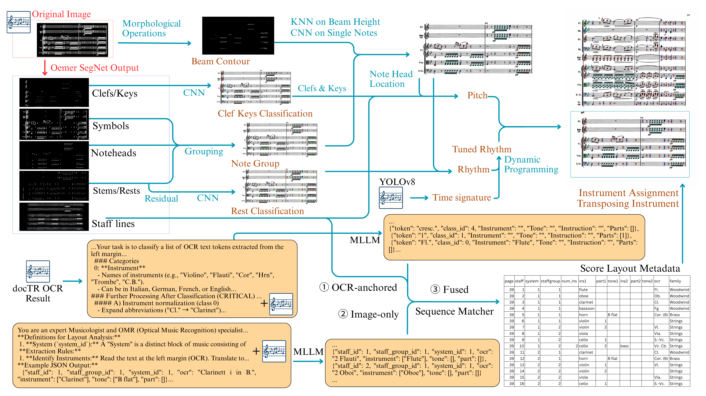
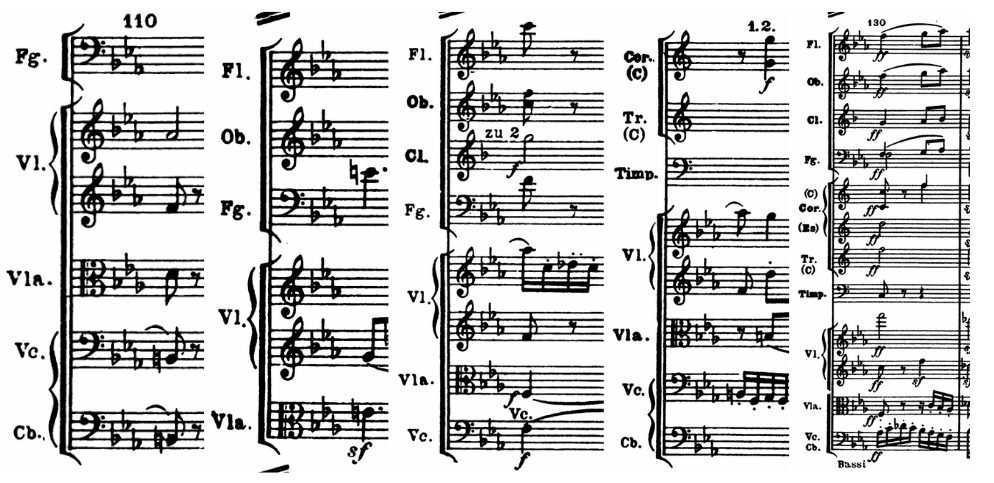

# Optical Music Recognition for Orchestral Full Scores with Varying Staff Layouts

Code for the paper *"Optical Music Recognition for Orchestral Full Scores with Varying Staff
Layouts"*, currently under review.

Orchestral full scores break the assumptions most OMR systems make: a dozen or more instruments in a
canonical order with hierarchical grouping, transposing parts whose written pitch differs from the
sounding pitch, and **a number of staves that changes from system to system** because resting
instruments are omitted. This repository implements a pipeline that reads the page layout and
instrument metadata with an MLLM + OCR, then feeds that metadata to a segmentation-based OMR
backbone so it can assemble a correct multi-instrument score.



*Above: the full pipeline. Below: why orchestral scores are hard — the same passage, with the set of
sounding instruments (and therefore the number of staves) changing from system to system.*



```
                 ┌──────────────────────── stage 1: layout metadata ───────────────────────┐
 page image ──┬─▶│ docTR OCR ─▶ filter to staff regions ─▶ MLLM token classification       │
              │  │ YOLO + oemer staff detection ─▶ MLLM staff-group/ensemble ─▶ matching   │──┐
              │  └────────────────────────────────────────────────────────────────────────┘  │
              │                                                          per-staff CSV ───────┤
              │  ┌──────────────────── stage 2: OMR backbone ────────────────────┐            │
              └─▶│ oemer segmentation ─▶ symbol assembly ─▶ key/rhythm consistency│◀───────────┘
                 └───────────────────────────────────────────────────────────────┘
                                                                    MusicXML ──▶ stage 3: TEDn, OMR-NED
```

## Repository layout

| Path | What it is |
|---|---|
| `stage1_layout/` | Layout + instrument metadata. Numbered scripts run in order 1→2a→2b→2c→3a→3b→4→5→6→8→b→7→f; `run_stage1.sh` drives them. |
| `stage1_layout/mllm/` | Open-source MLLM backends (Qwen3-VL-8B, InternVL3.5-8B) for steps 6 and 8. |
| `stage2_omr/` | OMR backbone. `run_omr.py` turns page image + metadata CSV into MusicXML. |
| `stage3_eval/` | TEDn, OMR-NED, and the stage-1 metadata metrics. |
| `scripts/` | `run_sample.sh` (end to end), `bridge_metadata_to_omr.py`, `fetch_weights.sh`. |
| `data/` | Where you place score images and ground truth — see [data/README.md](data/README.md). |
| `tools/` | `build_gt.py` rebuilds the reference MusicXML from the CCARH MuseData source. |

## Requirements

The stages need **separate environments**: the OMR backbone pins `numpy==1.26.4`, while the OCR and
detection stack needs numpy ≥ 2, and the evaluation stack needs a newer `music21` than the OMR stage.
Do not try to merge them.

```bash
conda create -n omr-meta  python=3.11 -y && conda activate omr-meta
pip install -r requirements/stage1_ocr.txt -r requirements/stage1_detect.txt -r requirements/stage1_mllm.txt

conda create -n omr-core  python=3.10 -y && conda activate omr-core
pip install -r requirements/stage2_omr.txt

conda create -n omr-eval  python=3.10 -y && conda activate omr-eval
pip install -r requirements/stage3_eval.txt
```

| Environment | Used by | Notes |
|---|---|---|
| `omr-meta` | stage 1 | docTR, ultralytics, transformers. A GPU is needed for the MLLM steps. |
| `omr-core` | stage 2 | `numpy==1.26.4` is required by the segmentation code. |
| `omr-eval` | stage 3 | `zss==1.2.0` (the version the paper's TEDn was computed with) and `musicdiff`. |

**GPU note.** The MLLM backends load in FP16 with `attn_implementation="sdpa"`, because the
development GPUs were Turing-class (sm_75), which support neither bf16 nor FlashAttention-2. An
8B VLM at FP16 needs roughly 18–20 GB of VRAM; `device_map="auto"` will shard it across two cards
if one is not enough. Install the torch build that matches your driver — a torch compiled against a
newer CUDA than the driver supports falls back to CPU silently, and an 8B VLM on CPU is unusably
slow. Check with `python -c "import torch; print(torch.cuda.is_available())"`.

**Input resolution.** Every backend sees the page downscaled to the resolution the OpenAI vision
API would actually use (short side 768, ~1.1 MP). This is deliberate: it is the only resolution
mode in this release, so the GPT / Qwen / InternVL comparison in Table 1 is over identical pixels.

## Model weights

Shipped in the repository: the layout YOLO (`stage1_layout/weights/`, 39 MB), the time-signature
YOLO and the clef/accidental/rest/stem CNNs (`stage2_omr/weights/`, `stage2_omr/training/`, 49 MB).

The two oemer segmentation networks are too large for git and are fetched from the upstream oemer
release. Stage 1 only counts staves and needs `unet_big`; stage 2 runs both passes
(`unet_big` + `seg_net`), so it needs both. The script verifies each download against a sha256 that
was checked to be byte-identical to the checkpoints used for the paper:

```bash
bash scripts/fetch_weights.sh     # oemer segmentation nets (68 MB + 37 MB), installed into both stages
```

The optional TrOMR checkpoint that ships with upstream oemer (`omr/transformer/`) is **not**
included: this pipeline never takes that path. The code is kept so the vendored package stays
intact.

MLLM weights are pulled from the Hugging Face hub on first use (~16 GB each). The three models in
Table 1 are the only ones offered: `--backend qwen3` (`Qwen/Qwen3-VL-8B-Instruct`, the default),
`--backend internvl3_5` (`OpenGVLab/InternVL3_5-8B`), and `--backend gpt` (GPT-5.1 via the OpenAI
API, no local weights). `--model-id` overrides the Hugging Face repo if you want to try another
checkpoint.

## Quickstart

The worked example is Beethoven Symphony No. 1, first movement, pages 1–10. Ten pages exercise
every stage, so that is all you need to fetch.

```bash
# 1. weights
bash scripts/fetch_weights.sh

# 2. reference MusicXML, rebuilt from the public MuseData source
python tools/build_gt.py --symphony 1 --pages 1-10

# 3. the ten matching page images -> data/sample/images/    (see data/README.md section 1)

# 4. run it
PY_STAGE1=$(conda run -n omr-meta which python) \
PY_STAGE2=$(conda run -n omr-core which python) \
PY_EVAL=$(conda run  -n omr-eval which python) \
bash scripts/run_sample.sh
```

That produces ten MusicXML files in `work/orch_dataset/Bee_1_challenge/xmls/` and scores them:
TEDn in `work/tedn_summary/`, OMR-NED in `work/omrned.json`.

A GPU is needed, because stage 1 runs an 8B VLM. There is a `--skip-stage1` flag that starts from
ground-truth metadata instead, but it only helps if you already have per-staff metadata CSVs for
your pages — this repository does not ship any, and the annotations behind the paper's Table 1 are
not part of the release. `data/README.md` section 3 documents the CSV format if you want to write
your own. Adding `--skip-stage2` on top re-runs only the scoring, which is useful once you have
predictions.

**Expected output — stage 1.** Our own run over Symphony No. 1 pages 1–10 with the default
`--backend qwen3` (Qwen3-VL-8B):

| | Sym 1, pages 1–10 | paper Table 1, ③ Fused (1062 pages) |
|---|---|---|
| staff-count acc. ↑ | 100.00% (10/10) | 100.00% |
| staff acc. ↑ | 98.64% (145/147) | 93.37% |
| instrument F1 ↑ | 98.76% | 94.68% |

Ten pages of one symphony are easier than the full 1062, so read this as a smoke test that the
pipeline is wired up correctly, not as a reproduction of Table 1. Reproducing even this much needs
your own images *and* your own per-staff annotations to score against — `run_sample.sh` skips the
metadata metrics when there is no reference, and still reports TEDn and OMR-NED.

What the run shows about *why* the fusion step matters: on pages 6 and 7 the staff detector returns
10 staves and the MLLM also reads 10, but the truth is 11 — and the fused output is 11 on both. The
sequence matcher in step 7 recovers staff counts that neither input branch got right on its own,
which is the ①→③ gap Table 1 measures.

Stage 1 is slow: with Qwen3-VL-8B on two Turing cards each of the two MLLM steps takes roughly
2–4 minutes per page.

**Expected output — stages 2–3.** With `--skip-stage1` on those same 10 pages:

| | Sym 1, pages 1–10 | paper, Sym 1 complete (133 pages) |
|---|---|---|
| TEDn ↓ | 28.48 | 24.89 |
| OMR-NED ↓ | 37.68 | 29.95 |

These ten pages score slightly worse than the symphony average because they are the opening of the
first movement, which is denser than average. Stage 2 takes roughly 3–4 minutes per page on CPU.

Note that `--skip-stage1` also skips the metadata metrics: with stage 1 turned off the pipeline is
fed the ground-truth metadata, so scoring it against the ground truth would trivially report 100%.
Run the full pipeline to get a meaningful Table 1 number.

### Running the stages separately

```bash
# stage 1 — one folder of page images -> one metadata CSV per page
bash stage1_layout/run_stage1.sh --images data/sample/images --sheet Bee_1_challenge \
     --work work --backend qwen3        # qwen3 | internvl3_5 | gpt

# bridge — lay the CSVs and images out the way stage 2 expects
python scripts/bridge_metadata_to_omr.py --metadata-dir work/metadata \
     --images-dir data/sample/images --sheet Bee_1_challenge --out work/orch_dataset

# stage 2 — MusicXML
cd stage2_omr && python run_omr.py --sheet Bee_1_challenge --pages 1-10 \
     --data-root ../work/orch_dataset

# stage 3
python stage3_eval/metadata_metrics.py --pred-dir work/orch_dataset/Bee_1_challenge/csv \
     --gt-dir data/sample/gt/metadata --sheet Bee_1_challenge
cd stage3_eval/tedn && python make_manifest.py --gt-dir ../../data/sample/gt/musicxml \
     --pred-dir ../../work/orch_dataset/Bee_1_challenge/xmls --out ../../work/tedn_manifest.json
python stage3_eval/omrned/run_omrned.py --gt-dir data/sample/gt/musicxml \
     --pred-dir work/orch_dataset/Bee_1_challenge/xmls
```

`--backend gpt` uses the OpenAI API instead of local weights; copy `stage1_layout/.env.example` to
`stage1_layout/.env` and put your key there. The file is gitignored.

**Disk warning.** Stage 2 caches its decode output per page (`.npy` ≈ 158 MB + `.pkl` ≈ 500 MB).
`run_omr.py` deletes the cache after writing each page's MusicXML; pass `--keep-cache` to keep it,
and budget ~660 MB per page if you do.

## Data

**This repository ships no score images and no ground truth.** Both derive from third-party
editions that are not ours to redistribute: the page scans are of the Eulenburg edition
(ed. Max Unger, 1938) obtained via [IMSLP](https://imslp.org), and the reference MusicXML derives
from the [CCARH](https://www.ccarh.org/publications/beethoven-symphonies/) MuseData edition of the
Beethoven symphonies, which is distributed under copyright and behind registration.

[data/README.md](data/README.md) gives the directory layout the scripts expect, where to obtain each
piece, and what the metadata CSV columns mean. Nothing in the pipeline is specific to Beethoven or
to that edition — any orchestral full-score scan works.

The reference MusicXML, at least, is scripted. The MuseData source is publicly readable, so
`tools/build_gt.py` fetches it, converts it and cuts it into pages:

```bash
python tools/build_gt.py --symphony 1 --pages 1-10   # the ten pages run_sample.sh uses
python tools/build_gt.py --all                       # all 1062 pages of symphonies 1–8
```

Ten pages is enough to exercise the whole pipeline, so that is all the imagery you need to track
down by hand. Only page images are needed to *run* the pipeline; ground truth is needed only to
*score* it, and `scripts/run_sample.sh` skips whichever metric has no reference rather than failing.

## Evaluation protocol

**TEDn** — normalized tree edit distance over MusicXML, with `<note>` elements flattened. Trees are
capped at 6000 nodes, and pages whose reference tree falls below 1000 nodes after truncation are
excluded, since a small denominator amplifies minor errors (`--min-gold-nodes 1000`; this is what
reproduces the paper's numbers — 6 of 1062 pages are dropped).

`stage3_eval/tedn/lean_zss.py` replaces `zss.distance` with a memory-lean implementation. Stock
`zss` 1.2.0 builds a `size_a × size_b` grid of Python lists recording the edit script even when it
is never requested, so memory grows as O(A·B·path). The distance is identical — verified
bit-for-bit on 22 pages spanning both comparison paths — but peak RAM drops from gigabytes to
~0.26 GB on the largest page.

**OMR-NED** — sequence edit distance over measures via `musicdiff --ml_training_evaluation`.

**Metadata metrics** — staff-count accuracy, staff accuracy, and micro-averaged instrument F1.

Both score metrics are edit distances: **lower is better**.

## Results

Layout metadata accuracy (paper Table 1), full pipeline (MLLM + OCR + matching):

| MLLM | staff-count acc. ↑ | staff acc. ↑ | instrument F1 ↑ |
|---|---|---|---|
| GPT-5.1 | 100.00% | 96.76% | 97.23% |
| Qwen3-VL-8B | 100.00% | 93.37% | 94.68% |
| InternVL3.5-8B | 100.00% | 79.69% | 82.19% |

Beethoven Symphonies 1–8, 1062 pages (paper Table 2). "Ours w/o metadata" is the ablation in which
the layout module is removed and each page is treated as a single system:

| | LEGATO OMR-NED | LEGATO TEDn | w/o metadata OMR-NED | w/o metadata TEDn | Ours OMR-NED | Ours TEDn |
|---|---|---|---|---|---|---|
| Sym 1 | 84.31 | 74.65 | 71.23 | 60.06 | **29.95** | **24.89** |
| Sym 2 | 89.11 | 73.47 | 87.72 | 76.71 | **54.74** | **41.96** |
| Sym 3 | 94.53 | 79.15 | 82.86 | 68.54 | **70.97** | **52.90** |
| Sym 4 | 95.73 | 79.33 | 73.10 | 63.13 | **37.05** | **33.79** |
| Sym 5 | 88.77 | 70.08 | 68.84 | 53.43 | **46.92** | **40.15** |
| Sym 6 | 96.78 | 81.56 | 82.27 | 68.95 | **47.73** | **38.78** |
| Sym 7 | 94.05 | 76.36 | 71.34 | 59.34 | **54.11** | **40.87** |
| Sym 8 | 95.89 | 78.29 | 73.00 | 65.56 | **45.17** | **39.14** |
| **Mean** | 92.95 | 76.87 | 76.51 | 64.38 | **50.30** | **40.30** |

## Known limitations

- Stage 1 assumes instrument labels are printed at the start of a system, as in most engraved
  orchestral scores. Scores that label instruments only on the first page are not handled.
- The OMR backbone processes staves independently, so notes that cross staves (common in piano
  grand staves) are recognised less reliably than in end-to-end models.
- Stage 2 runs page by page; there is no cross-page reconciliation beyond the carried time signature.

## License

MIT — see [LICENSE](LICENSE). This covers the code; the repository contains no third-party data.

## Citation

If this code is useful to you, cite the repository:

```bibtex
@software{omr_varying_staff,
  title  = {Optical Music Recognition for Orchestral Full Scores with Varying Staff Layouts},
  url    = {https://github.com/boyuan-ch/omr-varying-staff},
  year   = {2026}
}
```

The accompanying paper is under review; a citation for it will be added if and when it is published.

## Acknowledgements

The symbolic ground truth rests on the Beethoven digital edition of the **Center for Computer
Assisted Research in the Humanities (CCARH)**, Stanford, distributed in the MuseData format; this
work would not be possible without it. The page images come from the Eulenburg edition hosted by
**IMSLP / Project Petrucci**.

The OMR backbone extends [oemer](https://github.com/BreezeWhite/oemer). The TEDn implementation is
adapted from [olimpic-icdar24](https://github.com/ufal/olimpic-icdar24) (MIT). OMR-NED is computed
with [musicdiff](https://github.com/gregchapman-dev/musicdiff). LEGATO is used as the comparison
baseline.
